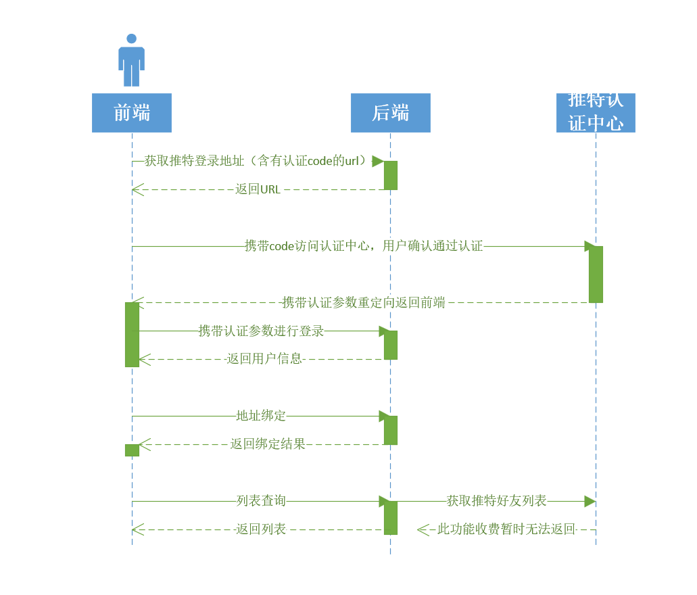

### 项目后端程序


使用docker-compose 进行构建，分为db,clash,web三大组件，后续可以将web中的缓存拆分成redis组件。


目前主要完成功能：twitter登录，web3钱包绑定，根据twitter name搜寻其地址，单向好友添加，好友昵称修改，好友删除

因好友列表功能在twitter的开放平台中是付费才能使用的，所以将会在下一个阶段进行完整的实现，现只使用后端完成好友功能。


启动方式：

```shell
docker-compose up
```

默认后端端口为 8080

接口文档

https://apifox.com/apidoc/shared-344674b9-40b4-42f0-8a0a-3baf31b226c2


如有问题，可联系陈思达(@AloneAtWar)，之后也可以拉进 apifox 方便测试 

# 后端逻辑

当前的逻辑



